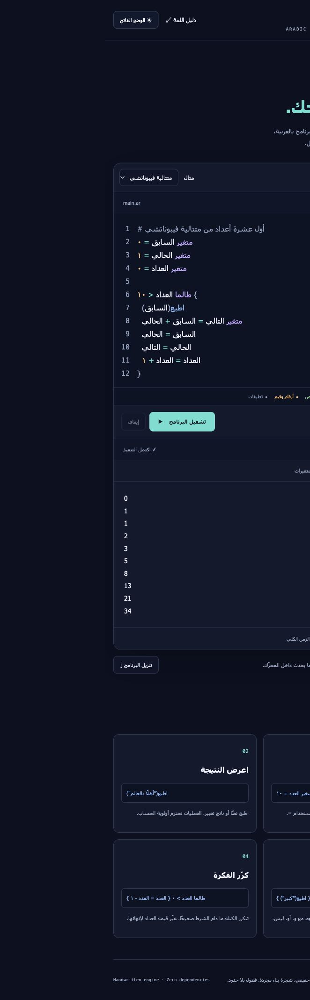

# Turjuman · ترجمان
### Arabic Programming Language & Web Playground

A small Arabic programming language built from first principles: a handwritten lexer, recursive-descent parser with precedence climbing, explicit abstract syntax tree, and tree-walking interpreter. Write Arabic programs, inspect their internal representation, and run them locally without accounts, API keys, paid services, or third-party runtime packages.



## Run on macOS / VS Code

1. Install Node.js 20 or newer, including npm, if not already installed.
2. Open this **arabic-programming-language** folder in VS Code (`File → Open Folder`).
3. Open its integrated terminal and run:

```sh
npm start
```

Open **http://localhost:3000**. Do not open `web/index.html` directly: browser module loading and Web Workers require the local server. No `npm install` is necessary because there are no dependencies. Stop the server with `Ctrl+C`.

```sh
npm test                    # Language + HTTP integration tests
npm run demo                # Fibonacci in the terminal
node src/cli.js examples/hello.ar
npm run dev                 # Restart the server when its files change
```

Refresh the browser after editing frontend files. Set `PORT=3001 npm start` if port 3000 is occupied. VS Code launch configurations are included for the server and the current `.ar` file. If `node` or `npm` is not found, install Node.js and reopen the terminal. The included automated tests use only Node's standard library.

## جرّبي اللغة

```text
متغير الاسم = "العالم"
اطبع("مرحبًا يا " + الاسم)

متغير العدد = ٥
متغير الناتج = ١
طالما العدد > ١ {
  الناتج = الناتج * العدد
  العدد = العدد - ١
}
اطبع(الناتج)
```

Output:

```text
مرحبًا يا العالم
120
```

- `متغير` defines a variable; `العدد = العدد - ١` updates it.
- `اطبع(...)` prints one expression.
- `إذا ... { ... } وإلا { ... }` selects a branch.
- `طالما ... { ... }` repeats a block while its condition is true.
- `صحيح`, `خطأ`, `و`, `أو`, `ليس` express boolean logic.
- Arabic-Indic digits `٠١٢٣٤٥٦٧٨٩` and ASCII digits are supported; decimal separator is `.`.
- Comments begin with `#` or `//`. Semicolons `;` and `؛` are optional after a statement.

Full syntax and semantics: [Language specification](docs/LANGUAGE.md).

## What makes this a CS project?

```text
Source → Lexer → Tokens → Parser → AST → Interpreter → Output
                                               ↘ Lexical scopes
```

The language is interpreted directly. It does not translate user code into JavaScript, call `eval`, or send code to AI. Each stage has a separate module and source-aware errors.

| Component | Responsibility |
| --- | --- |
| `src/language/lexer.js` | Tokenization, Unicode names, strings, digits, line/column positions |
| `src/language/parser.js` | Statements, operator precedence, associativity, AST construction |
| `src/language/interpreter.js` | Evaluation, nested scopes, strict types, bounded execution |
| `src/language/error.js` | Structured lexer/parser/runtime diagnostics |
| `src/language/index.js` | Shared `run(source)` entry point |
| `src/server.js` | Local HTTP server and `POST /api/run` |
| `src/cli.js` | Run `.ar` source files in the terminal |
| `web/` | Arabic playground, dedicated worker, token/AST/variable inspection |
| `tests/` | Language tests and real HTTP integration test |
| `examples/` | Hello world, factorial, Fibonacci |

Read [Architecture and tradeoffs](docs/ARCHITECTURE.md) for design decisions and complexity.

## Playground

Select an example, edit it, and click **تشغيل البرنامج** or press **⌘/Ctrl + Enter**. The output pane includes Tokens, AST, and global-variable tabs. Source is saved in this browser's local storage; **تنزيل البرنامج** exports a UTF-8 `.ar` file. The Stop button terminates the browser worker. Every run starts with fresh language memory.

The playground detects the Node backend through `/api/health` and runs code through `POST /api/run`. Each request executes in a disposable Node worker with memory and time limits. A static-only deployment falls back to a browser Web Worker and displays the active engine clearly. Both paths share the exact same language implementation. The editor includes token colors, a color legend, and persistent light/dark themes.

```sh
curl http://localhost:3000/api/run \
  -H 'Content-Type: application/json' \
  -d '{"source":"اطبع(٦ * ٧)"}'
```

Service failures return 408 (timeout), 503 (busy), or 500 (worker failure). Source longer than 20,000 characters returns 413. `/api/health` reports readiness without running user code.

The response contains `ok`, `output`, `variables`, `steps`, `tokens`, and `ast`. Language failures return HTTP 200 with `ok: false` and an `error` containing `phase`, `message`, `line`, and `column`. Invalid request JSON/schema returns 400, unsupported content type 415, and oversized HTTP bodies 413. Output before a runtime failure is preserved.

## Validation

Run `npm test`: 38 tests cover precedence, AST structure, source locations, strings, short-circuit logic, scope, branches, loops, diagnostics, resource limits, example outputs, and HTTP behavior. GitHub Actions runs these tests on Node 22. Tests also exercise concurrency, cancellation, timeouts, HTTP limits, traversal attempts, highlighter correctness, 500 deterministic malformed-input cases and 168 arithmetic property cases. Browser smoke checks cover backend execution, examples, diagnostics, theme switching and AST inspection. Timing includes network/worker startup and is not a benchmark.

## Deliberate v1 boundaries

This is an educational interpreter, not a production language or public code-execution service. It supports numbers, strings, and booleans; functions, arrays, user input, modules, and debugger stepping are future extensions. Execution stops at the first error. The editor uses a safe text-only syntax-highlighting layer over an accessible textarea; it does not provide autocomplete.

The server binds to loopback locally and `0.0.0.0` on Render. Source size, AST depth, evaluation steps, strings and total output are bounded. The backend permits four concurrent workers, rejects excess work with HTTP 503, terminates workers after two seconds, and cancels work when clients disconnect. Worker heap limits add another resource boundary. These controls suit a portfolio demo, not a hardened multi-tenant service; service-level abuse/rate controls remain a future improvement. No file/network operations are exposed to the language.

## Demo for a portfolio interview

1. Run Fibonacci and explain why each iteration gets its own local scope.
2. Inspect Tokens and AST; show multiplication binding tighter than addition.
3. Run the error example and explain the source location and preserved output.
4. Show the tests, then describe why short-circuit evaluation skips undefined variables on the unused side.

Suggested CV wording, once you have reviewed and can explain the implementation:

> Built an Arabic programming language with a handwritten lexer, precedence-aware parser, AST interpreter, lexical scoping, and source-positioned diagnostics; delivered a browser playground, Node.js API, CLI, and automated tests.

## Deployment on Render

Use a Node Web Service on the Free plan. Set the build command to `npm test`, the start command to `npm start`, and health check path to `/api/health`. `render.yaml` supplies these settings. Render provides `PORT`; the server uses `0.0.0.0` when `RENDER` is set. No API keys or database are needed. Free services may sleep while idle and take longer on first visit.

Choose a license before inviting reuse of the source. The repository includes a CI workflow and `.gitignore`.
